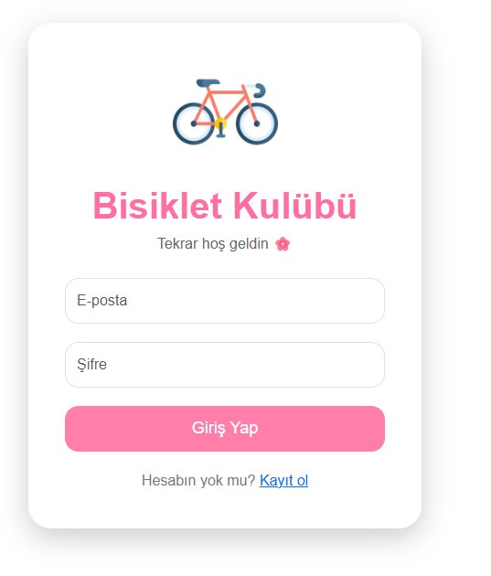
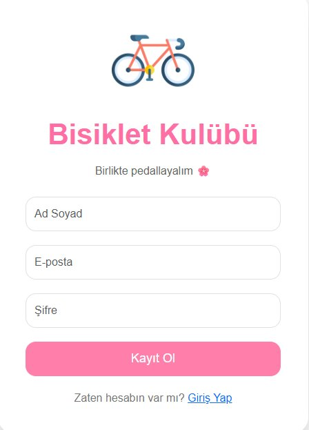
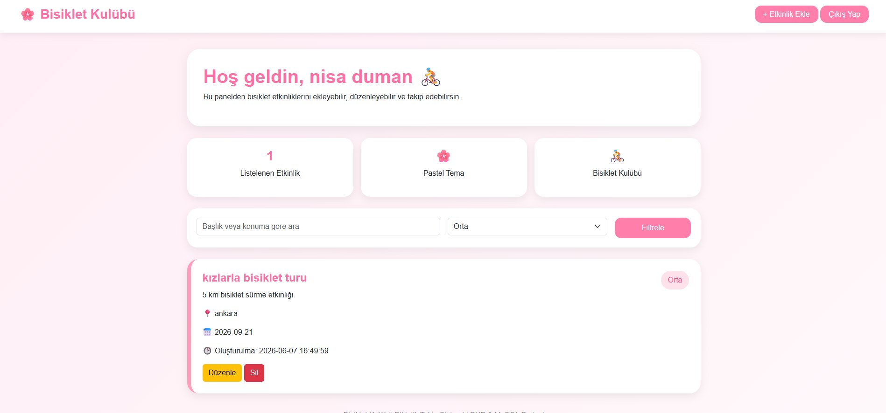
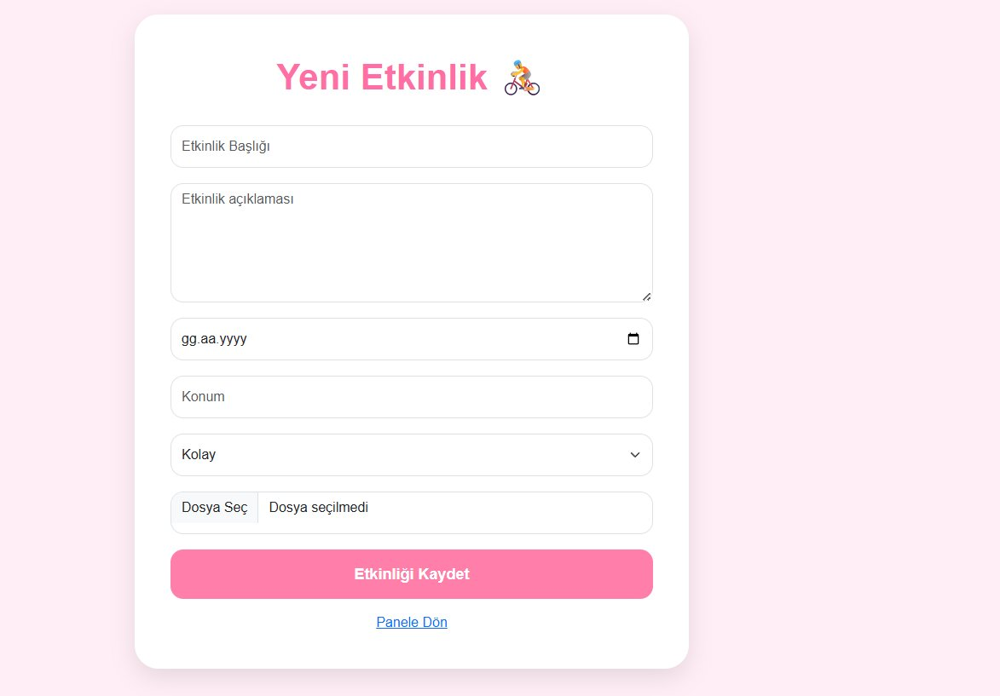

# 🚴 Bisiklet Kulübü — Etkinlik Takip Sistemi

PHP ve MySQL ile geliştirilmiş, kullanıcıların bisiklet etkinliklerini oluşturup yönetebileceği tam özellikli bir web uygulaması.

---


## 📸 Ekran Görüntüleri

### 🔐 Giriş Sayfası


### 📝 Kayıt Sayfası


### 🏠 Ana Panel


### ➕ Yeni Etkinlik Ekle


---

## 🎬 Tanıtım Videosu

> 📺 [https://youtu.be/9ni5mF5rELI](https://youtu.be/9ni5mF5rELI)

---

## ✨ Özellikler

- 🔐 **Kullanıcı Kaydı** — Ad soyad, e-posta ve şifreyle hesap oluşturma
- 🔑 **Güvenli Giriş/Çıkış** — Session tabanlı oturum yönetimi
- ➕ **Etkinlik Ekleme** — Başlık, açıklama, tarih, konum, zorluk ve görsel ile etkinlik oluşturma
- 📋 **Etkinlik Listeleme** — Kendi etkinliklerini kart yapısında görüntüleme
- ✏️ **Etkinlik Düzenleme** — Mevcut etkinlik bilgilerini güncelleme
- 🗑️ **Etkinlik Silme** — Onay ile güvenli silme
- 🔍 **Arama & Filtreleme** — Başlık/konum araması ve zorluk seviyesine göre filtreleme
- 🖼️ **Görsel Yükleme** — Etkinliklere fotoğraf ekleme

---

## 🛡️ Güvenlik

- Şifreler `password_hash()` ile hashlenerek veritabanına kaydedilir, düz metin saklanmaz
- Oturum yönetimi düz çerezler yerine PHP Sessions ile yapılır
- Tüm veritabanı işlemleri PDO Prepared Statements ile SQL Injection'a karşı korunur
- Çıktılar `htmlspecialchars()` ile XSS saldırılarına karşı temizlenir
- Düzenleme ve silme işlemlerinde `user_id` kontrolü yapılır — kullanıcılar yalnızca kendi etkinliklerine erişebilir

---

## 🗂️ Proje Yapısı

```
bisiklet_kulubu/
├── config.php          # Veritabanı bağlantısı
├── index.php           # Yönlendirme (login.php'ye)
├── login.php           # Giriş sayfası
├── register.php        # Kayıt sayfası
├── logout.php          # Çıkış işlemi
├── dashboard.php       # Ana panel — etkinlik listeleme
├── create_event.php    # Yeni etkinlik ekleme
├── edit_event.php      # Etkinlik düzenleme
├── delete_event.php    # Etkinlik silme
├── hobi_kulubu.sql     # Veritabanı şeması
├── uploads/            # Yüklenen etkinlik görselleri
├── screenshots/        # README için ekran görüntüleri
└── AI.md               # Yapay zeka araçlarıyla yapılan sohbetler
```

---

## 🗄️ Veritabanı Şeması

**`users` tablosu**

| Sütun | Tip | Açıklama |
|---|---|---|
| id | INT (PK) | Otomatik artan birincil anahtar |
| name | VARCHAR(100) | Kullanıcı adı soyadı |
| email | VARCHAR(100) | Benzersiz e-posta adresi |
| password | VARCHAR(255) | Hashlenmiş şifre |
| created_at | TIMESTAMP | Kayıt tarihi |

**`events` tablosu**

| Sütun | Tip | Açıklama |
|---|---|---|
| id | INT (PK) | Otomatik artan birincil anahtar |
| user_id | INT (FK) | Etkinliği oluşturan kullanıcı |
| title | VARCHAR(150) | Etkinlik başlığı |
| description | TEXT | Etkinlik açıklaması |
| event_date | DATE | Etkinlik tarihi |
| location | VARCHAR(150) | Konum |
| difficulty | VARCHAR(50) | Kolay / Orta / Zor |
| image | VARCHAR(255) | Yüklenen görsel dosya adı |
| created_at | TIMESTAMP | Oluşturulma tarihi |

---


## 🛠️ Kullanılan Teknolojiler

| Teknoloji | Kullanım Amacı |
|---|---|
| PHP (Yalın) | Backend — tüm sunucu tarafı işlemler |
| MySQL | Veritabanı yönetimi |
| Bootstrap 5 | Responsive arayüz tasarımı |
| HTML / CSS | Sayfa yapısı ve özel stiller |
| PDO | Güvenli veritabanı bağlantısı |

---

## 👤 Geliştirici

Bu proje bir PHP & MySQL dersi ödevi kapsamında geliştirilmiştir.

